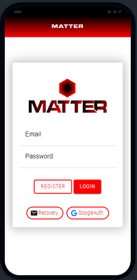
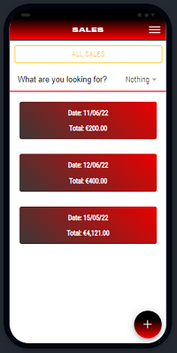

<h2 align="center">PROYECTO GRADO SUPERIOR EN DESARROLLO DE APLICACIONES MULTIPLATAFORMA I.E.S. CAMPANILLAS 21/22</h2>

  

## INTRODUCCIÓN

Tras 22 años dedicado al sector de la hostelería, y siendo conocedor de las herramientas
que se encuentran en estos momentos en el mercado, y que nos permiten administrar los diferentes
aspectos que componen el desarrollo diario de una empresa, decidí que era el momento idoneo para
llevar a cabo una herramienta que sintetizara y facilitara la administración de los ambitos más determinantes
que influyen en el buen devenir de una empresa.

Para el nombre de la aplicación nos inspiramos en aquellas cosas que de verdad nos importan, aquellas a las
que no nos importará dedicarles el tiempo que sea necesario, y que, aunque requieren de grandes sacrificios,
siempre nos retornarán las mayores satisfacciones.

## OBJETIVOS

Matters pretende ser un ERP de código abierto que trata de poner solución a la gestión de la
información que se desprende del funcionamiento habitual de cualquier empresa,
enfocandonos en la gestión de establecimientos hosteleros en su primera versión oficial.
Con capacidad de crecimiento en módulos, esta aplicación se encarga de la gestión de las facturas,
ventas, empleados, contabilidad, gráficas de estado, etc.
Con una interfaz sencilla y amigable, permitirá gestinoar facilmente los aspectos clave de nuestra empresa,
mejorando la toma de decisiones, y facilitanto la labor diaria que conlleva la gestiñon de una empresa.

## DESARROLLO

Para la ejecución de este proyecto, haremos uso de Ionic, Angular, Firebase, Cordova, Typescript, Python además de otras herramientas que a lo largo del proyecto iremos incorporando.
Se muestra a continuación algunas de ellas, así como el boceto inicial del que partiremos para la consecución del mismo.
El proyecto constará de la aplicación movil, una página para las gestiones de administración de la app, una Landing Page informativa sobre el producto y un sistema para recuperar información desarrollado en Python.
Se irá describiendo en el diario de trabajo las adesiones y cambios de las diferentes partes del proyecto en el momento en que se sucedan. 

## BIBLIOGRAFÍA
  - <a href="https://ionicframework.com/docs/">
Ionic
</a>
  - <a href="https://capacitorjs.com/">
Capacitor
</a>
  - <a href="https://ionicframework.com/docs/native/iamport-cordova">
Cordova
</a>
  - <a href="https://console.firebase.google.com/u/2/">
Firebase
</a>
  - <a href="https://www.typescriptlang.org/docs/">
TypeScript
</a>
  - <a href="https://angular.io/">
Angular
</a>
  - <a href="https://es.stackoverflow.com/">
StackOverflow
</a>
  - <a href="https://docs.python.org/3/">
Python
</a>

## ENLACES DE INTERÉS

  ### LANDING PAGE
  <a href="https://github.com/Davidrbv/LandingPageMatter">Matter Landing</a>

  ### VERSION MOVIL (APK)
<<<<<<< HEAD
  <a href="media/app-debug.apk">APK 15/06/2022</a>
=======
  <a href="media/app-debug.apk">APK Actual 12/05/2022</a>
>>>>>>> 4b8988c0efe0e985b7f10950a976d1b364e43493

  ### VIDEO DESARROLLO ACTUAL DE LA APP
  <a href="https://www.youtube.com/watch?v=cfXmQmpYGcg&ab_channel=davidrodriguez">Video</a>

  ### API PYTHON/FLASK
  <a href="https://github.com/Davidrbv/MatterAPI">API</a>

  ### VERSION WEB (Angular & PrimeNg)
  <a href="https://github.com/Davidrbv/MatterAccounting">Matter Accounting</a>

## DIARIO DE TRABAJO

  - ### Semana 1 y 2:
    - Inicio del proyecto.
    - Codificación de la base del proyecto, incluyendo la estructura principal de la app, así como parte de las funcionalidades a desarrollar.
    - Cración de estructura y conexión con base de datos (Firebase).
    - Se ha rediseñado el logo y marca de la aplicación.
    - Cambio en cabeceras de páginas.
    - Solucionado bugs llamadas empleados.
    - Elección de tipográfias (Microgramma y Roboto Condensed).
    - Elección de paleta de colores (Negro-Rojo).

  - ### Semana 3:
    - Agregado módulo dashboard a menu lateral.
    - Cambios en formatos de fecha en facturas y ventas.
    - Remodelación de busquedas tanto en ventas como en facturas para mayor versatilidad.
    - Inicio de la versión web creando las clases, componentes, paginas, modulos, servicios, almacenamiento en base de datos , así como toda la estructura base del proyecto.
    - Inicio de la LandingPage correspondiente a la parte comercial del proyecto dedicada a la promoción y venta del producto. Creación de la estructura de la web e insertado de los elementos
    básicos que compondrán la misma.

  - ### Semana 4:
    - Cambios sustanciales en los buscadores en los modulos de ventas y facturas App Ionic.
    - Construcción de la versión 1.0 Beta de la Landing Page, Readme inicial y primer mockup.
    - Cambios sustanciales en el módulo de estadísticas.

  - ### Semana 5:
    - Video explicativo de las diferentes funcionalidades que ofrece esta aplicación.
    - Desarrollo de la estructura de la API construida con Python y Flask con integración en Angular.

  - ### Semana 6:
    - Galeria de fotos habilitada, implantación de tipografía, cambios en el diseño principal de la web, desarrollo de autentificación con Google, recuperación de contraseña, modificación estadísticas, creación de la página de administración en el proyecto SPA (Angular).
    - Remodelación de API con Flask para integración con el proyecto desarrollado con Angular.
    - Corrección de bugs en filtros de la App y modificación de aspecto en Dashboard.

  - ### Semana 7:
    #### SPA (Angular)
    - Desarrollo de la apariencia y estilos en modulo administración.
    - Desarrollo funcionalidades modulo administración para gestión de usuarios.
    - Correción de bug en modulo empleados y login.
    - Remodelación de las funcionalidades del módulo estadisticas para consumo de API.
    - Remodelación interfaz user para festión de administradores.
    - Creación del servicio Flask para la gestiar la comunicación con la API.
    - Remodelación del resto de servicios para adaptación a nuevas funcionalidades.
    #### IonicApp
    - Corrección en la funcionalidad del login para adaptarlo a las funcionalidades del modulo de administración.
    - Modificación clase user para adaptación a nuevas funcionalidades.
    - Modificación de la funcionalidad, el aspecto y los estilos en edición de usuario, para adaptación
      a nuevos requerimientos.
    #### Python
    - Creación de endpoints para obstención de información necesaria en los modulos de administración y estadísticas.

  - ### Semana 8 (Entrega Final):

## Interfaz Actual

## Mockup App Inicial

