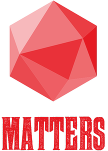
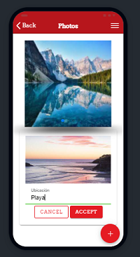

<!-- LOGO PROYECTO -->
 

  

  <h3 align="center">Matters</h3>
  

 

## Sobre el proyecto
Matters es un ERP de código abierto que trata de poner solución a la gestión de la
información que desprende cualquier empresa..
Enfocado en el sector de la hostelería, pero con capacidad de crecimiento en módulos,
se ocupa de la gestión de facturas, ventas, empleados, contabilidad, etc.
Con una interfaz sencilla y amigable, te permite gestionar tu negocio sin que suponer
esfuerzo alguno.

HomePAge: https://github.com/Davidrbv/Matters/tree/master/src/app/home

## Estructura del proyecto
<ul>
  <li>12 Páginas</li>
  <li>2 Componentes</li>
  <li>7 Servicios</li>
  <li>5 Clases</li>
  <li>1 Interfaz</li>
</ul>

 

Todas ellas interconectadas, haciendose uso de LocalStorage para la
persistencia de datos.

## Technologies Used

 
 

## Mockup App

